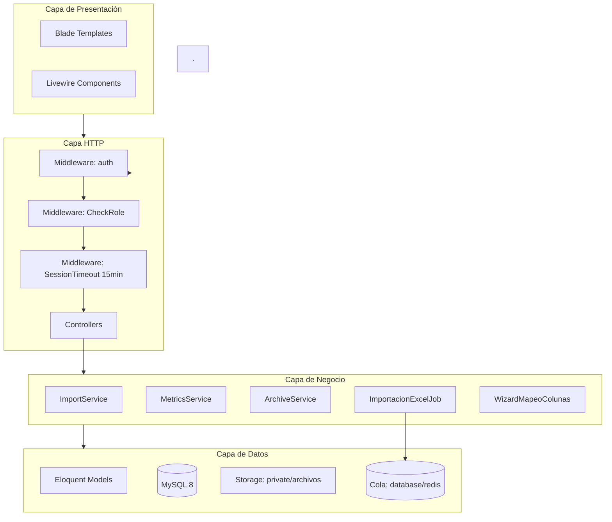

# Documento de Diseño Técnico
## Sistema de Métricas Corporativas — Corporación Socialista de Cemento
### Laravel 11 | PHP 8.2 | MySQL 8

---

## 1. Visión General

El sistema es una aplicación web monolítica construida sobre Laravel 11 con separación clara de capas: presentación (Blade + Livewire), lógica de negocio (Controllers + Jobs + Services) y persistencia (Eloquent ORM + MySQL). La arquitectura prioriza la seguridad por capas, la trazabilidad completa de operaciones y el procesamiento asíncrono de archivos pesados mediante colas de trabajo.

La decisión de usar un monolito en lugar de microservicios responde al contexto: hardware con recursos limitados, equipo de mantenimiento pequeño y la necesidad de despliegue simple. Laravel proporciona todos los primitivos necesarios (Jobs, Middleware, Queues, Eloquent) sin overhead de infraestructura adicional.

---

## 2. Arquitectura



### Decisiones de Arquitectura

| Decisión | Alternativa descartada | Justificación |
|---|---|---|
| Jobs + Queue para importación | Importación síncrona | Evita timeout HTTP en archivos grandes; libera el hilo del servidor |
| Upsert por cédula | Insert + validación en PHP | Una sola query SQL es exponencialmente más eficiente a 100k+ filas |
| Livewire polling (30s) | WebSockets (Reverb) | Menor complejidad de infraestructura; polling es suficiente para el caso de uso |
| MySQL usuario de solo lectura/escritura para audit_logs | Sin restricción | Garantiza inmutabilidad a nivel de motor de base de datos |
| Hash SHA-256 del archivo | Nombre del archivo | El nombre puede repetirse; el hash detecta duplicados exactos |

---

## 3. Componentes e Interfaces

### 3.1 Middlewares

**`CheckRole`** (existente, requiere hardening)
```
handle(Request, Closure, string $role): Response
```
- Valida autenticación y coincidencia exacta de rol.
- El admin bypasea la restricción de rol.
- Vulnerabilidad actual: no registra intentos de acceso no autorizado en audit_logs. Debe corregirse.

**`SessionTimeout`** (nuevo)
```
handle(Request, Closure): Response
```
- Lee `session('last_activity')`.
- Si `now() - last_activity > 900 segundos`, invalida la sesión y redirige al login.
- Actualiza `last_activity` en cada petición exitosa.

### 3.2 Controllers

**`UsuarioController`**: CRUD de usuarios (solo admin). Dispara `NotificacionCredenciales` Job.

**`ImportacionController`**: Recibe el archivo, valida, calcula SHA-256, presenta el Wizard, despacha `ImportacionExcelJob`.

**`MetricasController`** (refactor): Elimina HTML directo. Delega consultas a `MetricsService`. Registra auditoría.

**`AuditController`**: Lista paginada de `audit_logs` (solo admin).

**`ArchivadoController`**: Dispara `ArchivadoDatosJob` (solo admin).

### 3.3 Services

**`ImportService`**
```php
public function validarArchivo(UploadedFile $file): ValidationResult
public function calcularHash(UploadedFile $file): string
public function leerEncabezados(UploadedFile $file): array
public function validarMapeo(array $mapeo, array $encabezados): MapeoResult
public function validarTiposPostMapeo(array $muestraDatos, array $mapeo): array
```

**`MetricsService`**
```php
public function totalPorPlanta(): Collection
public function totalPorFilial(): Collection
public function inscritosVsNoInscritos(): array
public function distribucionPorEstado(): Collection
public function trazabilidadPorHora(): Collection
```

**`ArchiveService`**
```php
public function exportarAntiguos(int $diasAntiguedad = 365): string  // retorna path del archivo
public function purgarRegistrosArchivados(string $archivoPath): int  // retorna filas eliminadas
```

### 3.4 Jobs

**`ImportacionExcelJob`** (implements `ShouldQueue`)
- Procesa el Excel en chunks de 500 filas.
- Realiza `upsert` en `centro_metricas`.
- `tries = 3`, `backoff = [60, 300, 900]` segundos.
- Al completar: registra en `audit_logs`.

**`ArchivadoDatosJob`** (implements `ShouldQueue`)
- Exporta a CSV comprimido.
- Dentro de una transacción DB: si exportación OK → elimina registros.
- Si falla: rollback y registra en `audit_logs`.

### 3.5 Livewire Components

**`DashboardMetricas`**: Carga métricas desde `MetricsService`. Usa `wire:poll.30s`.

**`WizardMapeo`**: Multi-step. Paso 1: carga archivo. Paso 2: mapeo de columnas. Paso 3: confirmación y despacho.

---

## 4. Modelos de Datos

### 4.1 Tabla `users` (existente + extensión)
```sql
id, name, email, role ENUM('admin','supervisor','operador'), 
active BOOLEAN DEFAULT TRUE,  -- para desactivación sin borrado
password, remember_token, email_verified_at, timestamps
```

### 4.2 Tabla `centro_metricas` (nueva)
```sql
CREATE TABLE centro_metricas (
    id              BIGINT UNSIGNED AUTO_INCREMENT PRIMARY KEY,
    cedula          VARCHAR(8)  NOT NULL,
    nombres_apellidos VARCHAR(255),
    cargo           VARCHAR(255),
    ubicacion_administrativa VARCHAR(255),
    planta          VARCHAR(100),
    filial          VARCHAR(100),
    estado_ubicacion_fisica VARCHAR(100),
    telefono        VARCHAR(20),
    estado          VARCHAR(100),
    municipio       VARCHAR(100),
    parroquia       VARCHAR(100),
    centro_votacion VARCHAR(255),
    direccion_centro_votacion TEXT,
    estatus_voto    ENUM('Si','No') NULL,  -- resultado del cruce
    created_at      TIMESTAMP DEFAULT CURRENT_TIMESTAMP,
    updated_at      TIMESTAMP DEFAULT CURRENT_TIMESTAMP ON UPDATE CURRENT_TIMESTAMP,
    UNIQUE KEY uk_cedula (cedula),
    INDEX idx_planta (planta),
    INDEX idx_filial (filial),
    INDEX idx_estado (estado),
    INDEX idx_estatus_voto (estatus_voto)
);
```

### 4.3 Tabla `importaciones` (nueva — seguimiento de Jobs)
```sql
id, hash_archivo VARCHAR(64) UNIQUE, nombre_archivo, 
user_id FK, estado ENUM('pendiente','procesando','completado','fallido'),
total_filas, filas_insertadas, filas_actualizadas, filas_rechazadas,
log_errores JSON,  -- cédulas inválidas por fila
created_at, updated_at
```

### 4.4 Tabla `audit_logs` (existente)
Sin cambios estructurales. Se agrega restricción de usuario MySQL.

### 4.5 Modelo Eloquent `CentroMetrica`
```php
protected $fillable = ['cedula', 'nombres_apellidos', 'cargo', 
    'ubicacion_administrativa', 'planta', 'filial', 
    'estado_ubicacion_fisica', 'telefono', 'estado', 
    'municipio', 'parroquia', 'centro_votacion', 
    'direccion_centro_votacion', 'estatus_voto'];

// Scope para filtrar por estado
public function scopePorEstado($query, string $estado): Builder

// Scope para votantes
public function scopeVotantes($query): Builder
public function scopeNoVotantes($query): Builder
```

---

## 5. Propiedades de Corrección

*Una propiedad es una característica o comportamiento que debe mantenerse verdadero en todas las ejecuciones válidas de un sistema — esencialmente, un enunciado formal sobre lo que el sistema debe hacer. Las propiedades sirven como puente entre las especificaciones legibles por humanos y las garantías de corrección verificables por máquina.*

### Propiedad 1: El RBAC niega acceso a roles insuficientes
*Para cualquier* combinación de rol de usuario (`operador`, `supervisor`) y ruta protegida con nivel de acceso superior, el middleware `CheckRole` debe retornar HTTP 403 y no ejecutar el controlador destino.
**Valida: Requisito 1.2, 1.3**

### Propiedad 2: El hash rechaza archivos duplicados
*Para cualquier* archivo Excel subido cuyo SHA-256 ya exista en la tabla `importaciones`, el sistema debe rechazar la importación con un error de validación y no crear un nuevo registro en `importaciones` ni despachar un Job.
**Valida: Requisito 3.2**

### Propiedad 3: El mapeo requiere la cédula obligatoriamente
*Para cualquier* configuración de mapeo que no incluya el campo `cedula`, la función de validación de mapeo debe retornar un resultado inválido y el Job de Importación no debe despacharse.
**Valida: Requisito 3.4**

### Propiedad 4: La validación de tipos detecta incompatibilidades
*Para cualquier* muestra de datos donde una columna mapeada al campo `cedula` contenga valores no numéricos o fuera del rango de 7 a 8 dígitos, la función de validación de tipos debe retornar al menos un error de incompatibilidad.
**Valida: Requisito 3.5, 3.6**

### Propiedad 5: El procesamiento por chunks preserva el total de registros válidos
*Para cualquier* archivo Excel con N filas válidas (cédulas correctas), después de que el Job de Importación completa todos los chunks, la cantidad de registros en `centro_metricas` pertenecientes a esa importación debe ser igual a N.
**Valida: Requisito 4.3**

### Propiedad 6: El upsert es idempotente
*Para cualquier* conjunto de filas válidas, ejecutar el upsert dos veces con los mismos datos debe producir el mismo estado en `centro_metricas` que ejecutarlo una sola vez (misma cantidad de filas, mismos valores).
**Valida: Requisito 4.3**

### Propiedad 7: El cruce de datos clasifica todos los registros
*Para cualquier* conjunto de registros en `centro_metricas`, después del cruce con la tabla de votos, cada registro debe tener `estatus_voto` igual a `'Si'`, `'No'`, o `NULL` — y ningún registro puede quedar sin clasificar cuando existe un match de cédula en la tabla de votos.
**Valida: Requisito 5.2**

### Propiedad 8: El archivado es atómico — exportación y purga son inseparables
*Para cualquier* ejecución del proceso de archivado, si el archivo comprimido se genera correctamente, los registros archivados deben eliminarse de `centro_metricas`; si el archivo no se genera, ningún registro debe eliminarse.
**Valida: Requisito 8.2, 8.3**

### Propiedad 9: La auditoría registra toda acción clasificada sin pérdida
*Para cualquier* acción clasificada ejecutada por cualquier usuario, debe existir exactamente un registro en `audit_logs` con el `user_id`, `evento`, `direccion_ip` y `created_at` correctos, y ese registro no debe poder ser modificado ni eliminado.
**Valida: Requisito 7.1, 7.2**

---

## 6. Manejo de Errores

| Escenario | Estrategia |
|---|---|
| Archivo no es Excel válido | Validación en `ImportService` antes de mover al storage. HTTP 422 con mensaje. |
| Archivo duplicado (hash) | HTTP 409 Conflict. Mensaje con fecha de la importación original. |
| Cédula inválida en fila | Skip de fila + registro en `importaciones.log_errores` JSON. No detiene el Job. |
| Job falla 3 veces | Evento `JobFailed` → registro en `audit_logs` con stack trace resumido. |
| Timeout de sesión | Middleware `SessionTimeout` → redirect a login con mensaje flash. |
| Incompatibilidad de tipos en mapeo | Respuesta al Wizard con array de errores por columna. No despacha Job. |
| Archivado fallido | Rollback de transacción DB. Elimina archivo parcial de storage. Registra en audit. |
| Acceso no autorizado | Middleware CheckRole → HTTP 403. Registra en `audit_logs` el intento. |

---

## 7. Estrategia de Testing

### 7.1 Testing Unitario (PHPUnit)

Los tests unitarios verifican comportamientos específicos y casos borde de las capas de servicio y validación:

- `ImportServiceTest`: validación de archivo (extensión, tamaño, MIME), cálculo de hash, lectura de encabezados.
- `WizardMapeoTest`: casos concretos de mapeo válido e inválido, detección de incompatibilidades de tipo.
- `MetricsServiceTest`: queries con datasets conocidos, verificación de agrupaciones.
- `CheckRoleMiddlewareTest`: acceso autorizado/denegado para cada combinación de rol.
- `SessionTimeoutMiddlewareTest`: expiración exacta a los 900 segundos.

### 7.2 Testing Basado en Propiedades (Property-Based Testing)

**Librería seleccionada: `eris/eris`** — librería PHP de property-based testing que sigue el paradigma QuickCheck. Se instala como dependencia de desarrollo:

```bash
composer require --dev giorgiosironi/eris
```

Cada test de propiedades ejecuta un mínimo de **100 iteraciones** con datos generados aleatoriamente.

Cada test de propiedad debe estar anotado con el siguiente comentario exacto:
```
// Feature: sistema-metricas-corporativas, Property {N}: {texto de la propiedad}
```

**Propiedades a implementar:**

- **Propiedad 1** → `RbacPropertyTest`: genera combinaciones aleatorias de rol + ruta, verifica que CheckRole retorna 403 cuando el rol es insuficiente.
- **Propiedad 2** → `HashDuplicadoPropertyTest`: genera archivos aleatorios, calcula hash, intenta importar dos veces, verifica rechazo.
- **Propiedad 3** → `MapeoSinCedulaPropertyTest`: genera configuraciones de mapeo sin el campo `cedula`, verifica que la validación retorna inválido.
- **Propiedad 4** → `ValidacionTiposPropertyTest`: genera muestras con valores no numéricos en campo `cedula`, verifica detección de error.
- **Propiedad 5** → `ChunksTotalRegistrosPropertyTest`: genera N filas válidas, procesa, cuenta resultados en DB.
- **Propiedad 6** → `UpsertIdempotenciaPropertyTest`: ejecuta upsert dos veces con mismos datos, verifica estado idéntico.
- **Propiedad 7** → `CruceClasificacionPropertyTest`: genera registros y tabla de votos, verifica clasificación completa.
- **Propiedad 8** → `ArchivadoAtomicidadPropertyTest`: simula fallos en exportación, verifica que no se eliminan registros.
- **Propiedad 9** → `AuditoriaRegistroPropertyTest`: ejecuta acciones clasificadas, verifica existencia de log exacto y no modificabilidad.
